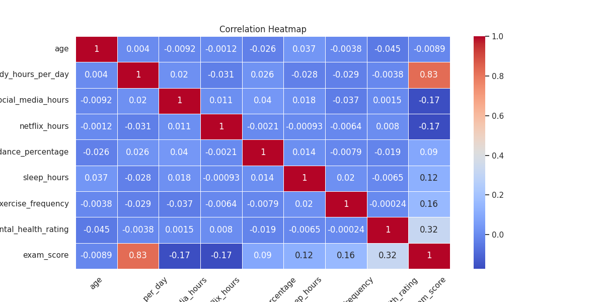
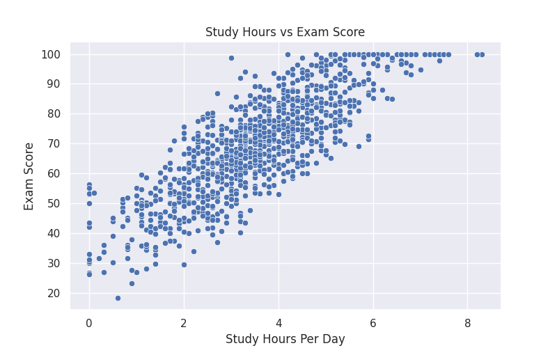
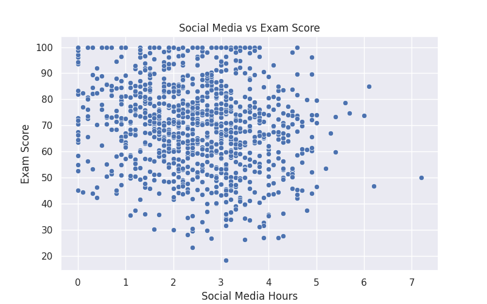

# Student Performance Analysis

Projeto de análise de dados utilizando Python para investigar como hábitos diários influenciam o desempenho acadêmico dos estudantes.

## Sobre o projeto

Neste projeto foi realizada uma análise exploratória de dados (EDA) utilizando bibliotecas de análise e visualização do ecossistema Python.

O objetivo é identificar padrões e relações entre hábitos dos estudantes, como horas de estudo, uso de redes sociais, sono, frequência escolar e saúde mental e suas notas em provas.

---

## Tecnologias utilizadas

* Python
* Pandas
* Matplotlib
* Seaborn
* Jupyter Notebook

---

## Análises realizadas

* Relação entre horas de estudo e desempenho
* Impacto do uso de redes sociais nas notas
* Influência do sono nos resultados acadêmicos
* Distribuição das notas dos estudantes
* Heatmap de correlação entre variáveis
* Identificação de padrões de comportamento acadêmico

---

## Principais insights

* Estudantes que dedicam mais horas aos estudos tendem a apresentar melhores notas.
* O uso excessivo de redes sociais apresentou correlação negativa com o desempenho acadêmico.
* A saúde mental apresentou relação moderada com os resultados das provas.
* Sono adequado e prática de exercícios físicos demonstraram impacto positivo no desempenho.

---

## Exemplos de visualizações

### Correlation Heatmap



---

### Study Hours vs Exam Score



---

### Social Media vs Exam Score



---

## Como executar o projeto

### 1. Clone o repositório

```bash
git clone https://github.com/Guicost/student-performance-analysis.git
```

### 2. Acesse a pasta

```bash
cd student-performance-analysis
```

### 3. Crie um ambiente virtual

Linux/macOS:

```bash
python3 -m venv venv
source venv/bin/activate
```

Windows:

```bash
python -m venv venv
venv\Scripts\activate
```

### 4. Instale as dependências

```bash
pip install -r requirements.txt
```

### 5. Execute o Jupyter Notebook

```bash
jupyter notebook
```

---

## Objetivo

Praticar:

* Análise exploratória de dados (EDA)
* Manipulação de dados com Pandas
* Visualização de dados
* Interpretação de correlações
* Organização de projetos de Data Science

